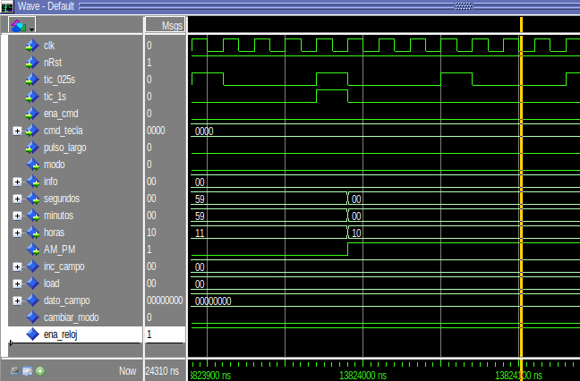

# Errores en diseño de reloj
### Lista de errores encontrados:
1.  Fallo de paso en las 11h a las 12h.  
  
**Error:** 
```vhdl
elsif (modo = '0' and horas = X"11") or (modo = '1' and horas = X"23") then
          horas(3 downto 0) <= "0000";
```
**Correcion:**
```vhdl
elsif (modo = '0' and horas = X"11" and AM_PM = '1') or (modo = '1' and horas = X"23") then
```
2. 

